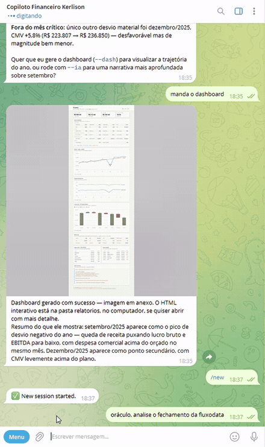
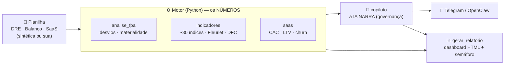

# 🔮 Oráculo — Copiloto de FP&A

> Um copiloto de análise financeira que faz, em segundos, o fechamento que um analista leva horas para montar — **sem alucinar números**, com **capital de giro pela ótica dinâmica (Fleuriet)** e **governança de verdade**.

[](https://github.com/kerlisonalbert/fin-copiloto-fpa/actions/workflows/testes.yml)


<p align="center">
  
</p>

<p align="center">
  <sub><b>Uma pergunta em português no Telegram.</b> O agente executa o motor de análise na máquina,
  responde com os números que saíram do código e envia o dashboard como imagem.</sub>
</p>

## O problema

Todo mês, o time de FP&A repete o mesmo ritual: comparar orçado vs realizado, caçar os desvios que importam, recalcular dezenas de indicadores, montar a DFC e escrever o comentário gerencial. É trabalho manual, sujeito a erro de fórmula — e o número que chega na diretoria nem sempre é rastreável.

O **Oráculo** faz esse fechamento em menos de um segundo, a partir de qualquer planilha, e explica o resultado como um analista sênior.

## O que ele faz · o que NÃO faz

**Faz:** análise de desvios (orçado × realizado) com materialidade e polaridade · ~30 indicadores · **capital de giro pelo modelo Fleuriet** · solvência por **Kanitz** e **Altman Z'** · **DFC** pelo método indireto · métricas **SaaS** (CAC, LTV, churn, NRR) · análise vertical · um **dashboard HTML** com semáforo e um comentário gerencial escrito por IA.

**NÃO faz:** recomendação de investimento (apenas conteúdo educacional) · não inventa números (se não sabe, diz) · não executa ação crítica sem confirmação humana.

## Os diferenciais

**1. Números vêm do código, narrativa vem da IA.**
Todos os cálculos são feitos em Python testado. A IA só **interpreta** — está proibida de produzir um valor. Se não executou, não sabe, e diz que não sabe. Isso elimina o maior medo de IA em finanças: o número plausível e errado, que parece certo e por isso ninguém confere.

**2. Capital de giro pela ótica dinâmica — o modelo Fleuriet.**
A maioria das ferramentas para em liquidez corrente. Aqui o balanço é reclassificado entre operacional e financeiro para calcular **NCG** (necessidade de capital de giro), **CDG** (capital de giro) e o **Saldo de Tesouraria** — que é onde aparece o *efeito tesoura*: a empresa cresce, a NCG cresce junto, e o caixa aperta mesmo com lucro. Some a isso os prazos médios (PMR/PME/PMP), os ciclos operacional e financeiro, e a solvência por **Kanitz** e **Altman Z'** (na variante de empresa fechada, com os coeficientes corretos). É o vocabulário da controladoria brasileira, implementado e testado.

**3. Governança embutida.**
Cada cifra é **rastreável** à sua origem (competência/conta). Ações sensíveis exigem confirmação humana (*human-in-the-loop*). Respeita a LGPD. Recusa recomendação de investimento. E a política é **verificada por CI**, não só declarada (veja abaixo).

**4. Bring your own data.**
Funciona com **qualquer** planilha no formato `competencia, conta, orcado, realizado`. Os dados sintéticos são só a demonstração; a planilha real vai em `dados/minhas/`, que está no `.gitignore` — e o CI falha se algo escapar para lá.

## Demonstração — 3 setores, 3 histórias

Cada empresa fictícia esconde um problema realista que o Oráculo descobre sozinho:

| Empresa | Setor | Achado plantado |
|---|---|---|
| Construtora Horizonte | Construção | Estouro no custo do aço (jul) → **EBITDA −74%** no mês |
| FluxoData | SaaS | **Churn** dispara (set) → receita e NRR caem |
| Rede BomPreço | Varejo | Volume sobe, mas **margem despenca** (nov) por excesso de desconto |

## O dashboard


Um único arquivo HTML, sem dependência de front-end: os gráficos são SVG escrito à mão.
Tema claro e escuro (o escuro tem passos próprios da paleta, não é uma inversão),
tooltip com os valores do mês ao passar o mouse, tabelas ordenáveis e uma **tabela
equivalente para cada gráfico** — nenhum número existe apenas no tooltip.

A paleta é validada para **separação sob daltonismo**, e o semáforo usa **forma além
de cor** (● bom · ▲ atenção · ■ crítico): o relatório continua legível impresso em
preto e branco.

## Ganho de tempo — o que é medido e o que é estimativa

Duas afirmações diferentes, e faz diferença separá-las:

| | Valor | Origem |
|---|---|---|
| Execução da ferramenta | **~0,5 s** (análise ou dashboard completo) | **Medido.** Mediana de 3 execuções; cerca de 0,33 s é só o Python carregando o pandas. Reproduza com `python src/copiloto.py dados/dre-fluxodata.csv --offline` |
| Ciclo manual equivalente | **6 a 8 h** por fechamento | **Estimativa**, a partir da minha experiência em controladoria — não é medição com cronômetro |

Ou seja: o "de horas para segundos" tem um lado verificável e um lado estimado, e a estimativa está declarada como tal. **Se for usar isso para justificar um investimento, meça o tempo do seu próprio processo** — o número acima é o meu ponto de partida, não o seu resultado.

O que **não** é estimativa: zero erro de fórmula (as fórmulas são testadas, veja abaixo) e trilha de auditoria em cada número.

## Testes e integração contínua

25 testes automatizados, rodando a cada push em Python 3.10 e 3.12. Em três frentes:

- **Invariantes** — o balanço fecha (Ativo = Passivo em todo mês), a cascata da DFC soma, os ciclos são coerentes.
- **Golden file** (`tests/test_golden_indicadores.py`) — uma empresa-teste de números redondos com os ~30 indicadores travados contra valores **calculados à mão a partir da definição de cada um**, não copiados da saída do código. Um golden file gerado pelo próprio programa congelaria o bug junto com o acerto; a derivação de cada número está escrita em comentário, para auditoria sem executar nada.
- **Governança executável** — o CI falha se qualquer planilha escapar para `dados/minhas/`, se alguma chave de API for versionada, ou se os dados sintéticos publicados divergirem do que o gerador produz (semente fixa: o dado publicado tem que ser exatamente o que o script gera).

Por que golden file importa aqui: **indicador financeiro errado não quebra — ele mente em silêncio.** Um ROIC com o denominador trocado passa por qualquer teste de invariante, continua plausível, e a IA vai explicá-lo com eloquência.

## Arquitetura



A camada que liga o motor ao agente do Telegram está documentada em [`integracao/`](integracao/).

## Como rodar

```bash
git clone https://github.com/kerlisonalbert/fin-copiloto-fpa
cd fin-copiloto-fpa
python -m pip install -r requirements.txt

python dados/gerar_sinteticos.py                 # gera os dados sintéticos

# análise no terminal (modo offline não precisa de chave):
python src/copiloto.py dados/dre-fluxodata.csv --offline

# dashboard HTML (abre exemplos/relatorio-fluxodata.html):
python src/gerar_relatorio.py dados/dre-fluxodata.csv dados/balanco-fluxodata.csv --saas dados/saas-fluxodata.csv

# para rodar os testes, instale também as dependências de desenvolvimento:
python -m pip install -r requirements-dev.txt
python -m pytest                                 # 25 testes
```

Para a narrativa com IA, copie `.env.example` para `.env` e preencha `ANTHROPIC_API_KEY`.

## Governança & dados

- **100% sintético.** Nenhum dado real de empresa. O script `dados/gerar_sinteticos.py` gera tudo de forma determinística (semente 42), e o CI verifica que o dado versionado é exatamente a saída do script.
- **Rastreabilidade** em cada número; **human-in-the-loop** nas ações críticas; **LGPD** respeitada.
- Indicadores de mercado (P/L, EV/EBITDA…) **não** entram aqui — dependem de preço de ação e pertencem à análise de empresa listada.

## Stack

Python · pandas · numpy · Anthropic (IA) · SVG puro (gráficos, sem dependência de front-end).

## Limitações

Ferramenta de **apoio**: as conclusões devem ser validadas por um profissional. Especificamente:

- **Premissas parametrizáveis, não medidas.** WACC, alíquota de IR, juros, depreciação, CAPEX e payout têm valores padrão (`PREMISSAS_PADRAO`) que **precisam ser calibrados por empresa**. Todo indicador derivado deles — EVA, ROIC, cobertura de juros, a DFC inteira — herda essa premissa.
- **Liquidez geral simplificada.** A fórmula clássica é `(AC + Realizável a Longo Prazo) / (PC + PNC)`. Este modelo usa apenas o AC no numerador, porque o plano de contas do projeto não tem RLP. Numa empresa **com** realizável a longo prazo, o índice sairia subestimado.
- **DFC analítica.** É o método indireto reconstruído a partir da DRE e da variação do balanço — não é a DFC contábil publicada, que parte da movimentação de caixa efetiva.
- **Prazos médios sobre o mês de referência.** PMR/PME/PMP usam o fluxo do mês (×30), não a média do período. Em negócio muito sazonal, o mês escolhido distorce o ciclo.
- **Margem de contribuição com rateio fixo.** O modelo trata 60% das despesas comerciais como variáveis e 40% como fixas. É uma convenção razoável, não uma medição da estrutura de custos da empresa.
- **A narrativa é gerada por IA.** Os números são do código, mas a *leitura* é interpretação — e interpretação erra. Ela nunca deve substituir o julgamento de quem responde pelo número.

## Roadmap

Versão atual: **v0.1.0** — motor, indicadores, DFC, dashboard, integração com Telegram e alerta agendado.

Próximos passos, em ordem de intenção:

- [ ] Ler `.xlsx` direto, sem passar por CSV
- [ ] Realizável a longo prazo no plano de contas, corrigindo a liquidez geral
- [ ] Avaliação automatizada da narrativa (a IA erra a *leitura*; hoje isso não é medido)
- [ ] Permissões mínimas no agendamento (o job hoje roda com o conjunto completo de ferramentas)
- [ ] Execução do alerta sem depender da máquina ligada

---

> ⚠️ Fins educacionais e de portfólio. **Não constitui recomendação de investimento.**
>
> Parte do meu portfólio de **Finanças + Dados + Governança**.
