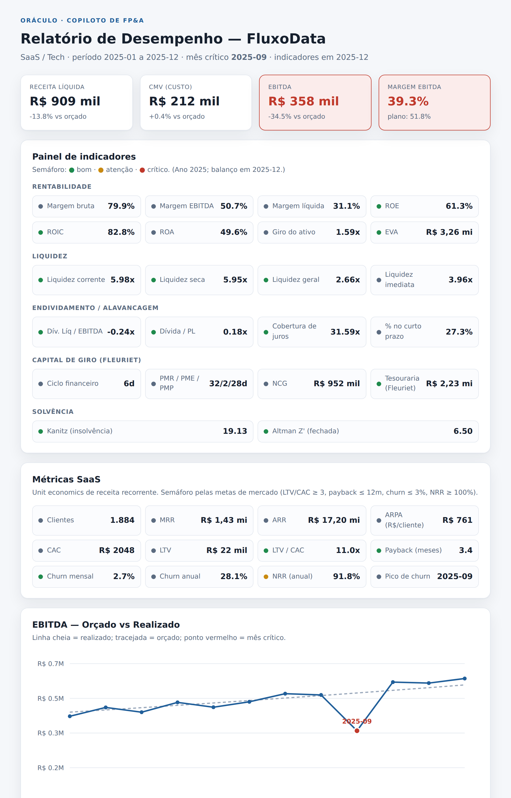
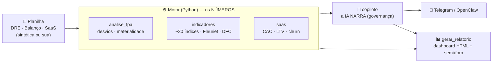

# 🔮 Oráculo — Copiloto de FP&A

> Um copiloto de análise financeira que faz, em segundos, o fechamento que um analista leva horas para montar — **sem alucinar números** e com **governança de verdade**.




## O problema

Todo mês, o time de FP&A repete o mesmo ritual: comparar orçado vs realizado, caçar os desvios que importam, recalcular dezenas de indicadores, montar a DFC e escrever o comentário gerencial. São **6 a 8 horas** de trabalho manual, sujeito a erro de fórmula — e o número que chega na diretoria nem sempre é rastreável.

O **Oráculo** faz esse fechamento **em segundos**, a partir de qualquer planilha, e explica o resultado como um analista sênior.

## O que ele faz · o que NÃO faz

**Faz:** análise de desvios (orçado × realizado) com materialidade · ~30 indicadores (rentabilidade, liquidez, endividamento, capital de giro pelo modelo **Fleuriet**, solvência **Kanitz/Altman**) · **DFC** pelo método indireto · métricas **SaaS** (CAC, LTV, churn, NRR) · análise vertical · um **dashboard HTML** com semáforo e um comentário gerencial escrito por IA.

**NÃO faz:** recomendação de investimento (apenas conteúdo educacional) · não inventa números (se não sabe, diz) · não executa ação crítica sem confirmação humana.

## Os 3 diferenciais

1. **Números vêm do código, narrativa vem da IA.** Todos os cálculos são feitos em Python (corretos e testados). A IA só **interpreta** — está proibida de inventar um valor. Isso elimina o maior medo de IA em finanças: o número alucinado.
2. **Governança embutida.** Cada cifra é **rastreável** à sua origem (competência/conta). Ações sensíveis exigem confirmação humana (*human-in-the-loop*). Respeita a LGPD. Recusa recomendação de investimento.
3. **Bring your own data.** Funciona com **qualquer** planilha no formato `competencia, conta, orcado, realizado`. Os dados sintéticos são só a demonstração; a ferramenta aceita a planilha real da sua área (que fica local).

## Demonstração — 3 setores, 3 histórias

Cada empresa fictícia esconde um problema realista que o Oráculo descobre sozinho:

| Empresa | Setor | Achado plantado |
|---|---|---|
| Construtora Horizonte | Construção | Estouro no custo do aço (jul) → **EBITDA −74%** no mês |
| FluxoData | SaaS | **Churn** dispara (set) → receita e NRR caem |
| Rede BomPreço | Varejo | Volume sobe, mas **margem despenca** (nov) por excesso de desconto |

## 💰 ROI

Uma análise mensal completa (desvios + ~30 indicadores + DFC + relatório comentado) consome **~6–8 h** de um analista. O Oráculo entrega em **segundos** → cerca de **80 horas/ano** liberadas por analista, com **zero erro de fórmula** e trilha de auditoria.

## Arquitetura



## Como rodar

```bash
git clone https://github.com/kerlisonalbert/fin-copiloto-fpa
cd fin-copiloto-fpa
python -m pip install -r requirements.txt

python dados/gerar_sinteticos.py                 # gera os dados sintéticos

# análise no terminal (modo offline não precisa de chave):
python src/copiloto.py dados/dre-fluxodata.csv --offline

# dashboard HTML (abre exemplos/relatorio-fluxodata.html):
python src/gerar_relatorio.py dados/dre-fluxodata.csv dados/balanco-fluxodata.csv --saas dados/saas-fluxodata.csv

# para rodar os testes, instale tambem as dependencias de desenvolvimento:
python -m pip install -r requirements-dev.txt
python -m pytest                                 # roda os 11 testes
```

Para a narrativa com IA, copie `.env.example` para `.env` e preencha `ANTHROPIC_API_KEY`.

## Governança & dados

- **100% sintético.** Nenhum dado real de empresa. O script `dados/gerar_sinteticos.py` gera tudo de forma determinística.
- **Rastreabilidade** em cada número; **human-in-the-loop** nas ações críticas; **LGPD** respeitada.
- Indicadores de mercado (P/L, EV/EBITDA…) **não** entram aqui — dependem de preço de ação e pertencem à análise de empresa listada.

## Stack

Python · pandas · numpy · Anthropic (IA) · SVG puro (gráficos, sem dependência de front-end).

## Limitações

Premissas (WACC, alíquota, depreciação) são parametrizáveis e devem ser calibradas por empresa. A DFC é analítica (método indireto). O modelo é uma ferramenta de **apoio** — as conclusões devem ser validadas por um profissional.

---

> ⚠️ Fins educacionais e de portfólio. **Não constitui recomendação de investimento.**
>
> Parte do meu portfólio de **Finanças + Dados + Governança**.
