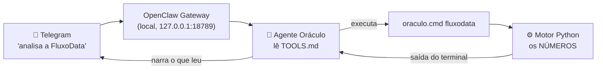

# Integração com o OpenClaw — o Oráculo no Telegram

Esta pasta contém a camada que transforma o motor de FP&A em um **agente
conversacional**: o usuário pede a análise pelo Telegram e recebe o resultado
narrado, com os números calculados por código.

## Como funciona

O ponto central: **o agente não calcula nada**. Ele lê o `TOOLS.md`, descobre
qual comando rodar, executa, lê a saída e narra. Se o comando falhar, ele diz
que falhou — não estima.

## Arquivos

| Arquivo | Onde vive de verdade | Papel |
|---|---|---|
| `oraculo.cmd` (raiz do projeto) | no repositório | Atalho: resolve caminhos e escolhe o modo (offline / `--ia` / `--dash`) |
| `TOOLS.md` (cópia aqui) | `~/.openclaw/workspace/TOOLS.md` | Ensina ao agente onde está a ferramenta, como chamá-la e as regras de governança |

> A cópia do `TOOLS.md` está versionada aqui para documentação e reuso. O arquivo
> que o agente realmente lê fica no workspace do OpenClaw.

## Governança embutida na integração

O `TOOLS.md` carrega as regras que o agente **não pode** violar:

- nunca inventar ou estimar um número — todo valor tem que ter saído da execução;
- se o comando falhar, admitir a falha em vez de preencher a lacuna;
- não emitir recomendação de investimento;
- rastreabilidade: competência (AAAA-MM) e conta de origem em cada número;
- human-in-the-loop antes de qualquer ação crítica;
- deixar explícito que os dados de demonstração são sintéticos.

## Modo padrão = offline (controle de custo)

Sem flag, o `oraculo.cmd` roda o modo **determinístico**, que não consome crédito
de IA. A narrativa por IA só acontece com `--ia`, pedida explicitamente. Se o
agente entrar em laço e chamar a ferramenta dez vezes, o custo continua zero.

## Reproduzindo em outra máquina

1. Instale o OpenClaw e conecte um canal (Telegram é o mais rápido).
2. Copie o `TOOLS.md` desta pasta para `~/.openclaw/workspace/TOOLS.md`.
3. Ajuste o caminho do projeto dentro dele.
4. `openclaw gateway restart` — o agente lê o arquivo ao iniciar a sessão.

### Armadilha conhecida (Windows/PowerShell)

Chamar um caminho entre aspas **sem o operador `&`** faz o PowerShell tratá-lo
como texto, não como comando, e a execução retorna `exitCode 1`. Por isso o
`TOOLS.md` documenta a linha de chamada completa, com o `&` no início.
