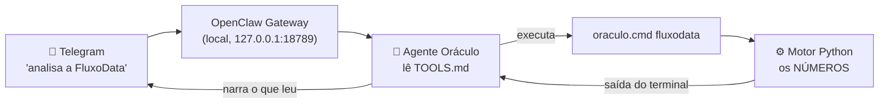

# Integração com o OpenClaw — o Oráculo no Telegram

Esta pasta contém a camada que transforma o motor de FP&A em um **agente
conversacional**: o usuário pede a análise pelo Telegram e recebe o resultado
narrado, com os números calculados por código.

## Como funciona

O ponto central: **o agente não calcula nada**. Ele lê o `TOOLS.md`, descobre
qual comando rodar, executa, lê a saída e narra. Se o comando falhar, ele diz
que falhou — não estima.

## Os quatro arquivos que definem o agente

Cada um responde a uma pergunta diferente. Separá-los é o que permite mudar o
comportamento sem mexer na identidade, e trocar de ferramenta sem reescrever a
doutrina.

| Arquivo | Responde | Vive em |
|---|---|---|
| `IDENTITY.md` | **Quem eu sou?** — nome, tom, foco | `~/.openclaw/workspace/` |
| `SOUL.md` | **Como eu penso?** — doutrina analítica e regras invioláveis | `~/.openclaw/workspace/` |
| `TOOLS.md` | **O que eu sei fazer aqui?** — comandos, caminhos, armadilhas | `~/.openclaw/workspace/` |
| `USER.md` | **Com quem eu trabalho?** — contexto e preferências da pessoa | `~/.openclaw/workspace/` |

Três deles estão versionados nesta pasta como documentação e para reuso.

> **`USER.md` fica de fora de propósito.** Ele contém dados pessoais (nome,
> localidade, identificador de canal). Documento a existência do arquivo, não o
> conteúdo — princípio de minimização da LGPD aplicado ao próprio repositório.

| Arquivo | Onde vive de verdade | Papel |
|---|---|---|
| `oraculo.cmd` (raiz do projeto) | no repositório | Atalho: resolve caminhos e escolhe o modo (offline / `--ia` / `--dash`) |
| `TOOLS.md`, `SOUL.md`, `IDENTITY.md` (cópias aqui) | `~/.openclaw/workspace/` | O que o agente lê ao iniciar a sessão |

## Governança embutida na integração

O `TOOLS.md` carrega as regras que o agente **não pode** violar:

- nunca inventar ou estimar um número — todo valor tem que ter saído da execução;
- se o comando falhar, admitir a falha em vez de preencher a lacuna;
- não emitir recomendação de investimento;
- rastreabilidade: competência (AAAA-MM) e conta de origem em cada número;
- human-in-the-loop antes de qualquer ação crítica;
- deixar explícito que os dados de demonstração são sintéticos.

## Modo padrão = offline (controle de custo)

Sem flag, o `oraculo.cmd` roda o modo **determinístico**, que não consome crédito
de IA. A narrativa por IA só acontece com `--ia`, pedida explicitamente. Se o
agente entrar em laço e chamar a ferramenta dez vezes, o custo continua zero.

## Reproduzindo em outra máquina

1. Instale o OpenClaw e conecte um canal (Telegram é o mais rápido).
2. Copie o `TOOLS.md` desta pasta para `~/.openclaw/workspace/TOOLS.md`.
3. Ajuste o caminho do projeto dentro dele.
4. `openclaw gateway restart` — o agente lê o arquivo ao iniciar a sessão.

### Três armadilhas conhecidas (Windows/PowerShell)

Todas apareceram na prática e estão documentadas no `TOOLS.md` para o agente
não repeti-las:

1. **Caminho entre aspas sem o operador `&`** — o PowerShell trata como texto,
   não como comando. Retorna `exitCode 1`.
2. **`cd ... && comando`** — o Windows PowerShell 5.1 **não suporta `&&`**
   (erro: `token '&&'`). Por isso o `oraculo.cmd` resolve os próprios caminhos:
   pode ser chamado de qualquer pasta, em uma linha só.
3. **Caminho com espaços no anexo** — a camada de entrega do OpenClaw quebra o
   caminho no primeiro espaço ao tentar anexar o arquivo (`Media failed`, com um
   pedaço do caminho vazando no texto da mensagem). Solução: o dashboard é
   gravado em `%USERPROFILE%\.openclaw\workspace\relatorios\` — **sem espaços** —
   e uma cópia vai para `exemplos/` do repositório.

> Lição transversal: quando a ferramenta é frágil, conserte a **ferramenta**.
> Instruir o agente a "tomar cuidado" funciona hoje e falha amanhã.
